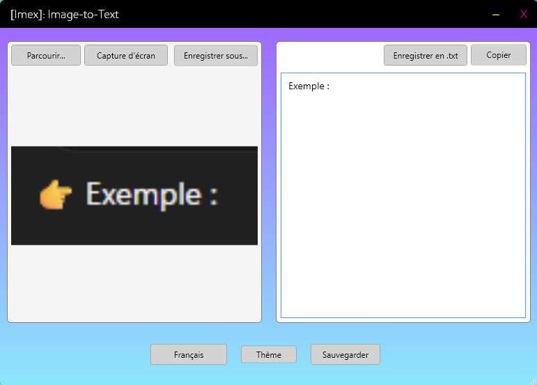
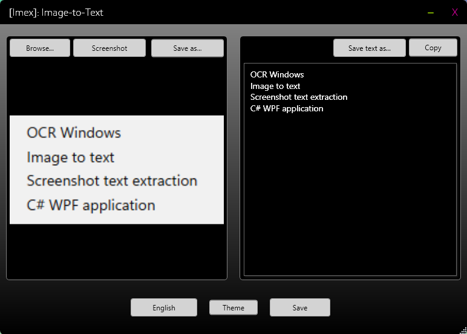

# IMEX

IMEX est une application de bureau portable pour Windows 11 permettant de capturer ou importer des images et d’en extraire le texte via OCR.

Elle est développée par vibe coding en C# / WPF et fonctionne entièrement en local.

---

## 📥 Télécharger

👉 [Télécharger la dernière version](https://github.com/Liquid-F0rm/IMEX/releases/latest)

---

✨ Fonctionnalités

🖼️ Entrée d’images
* Capture d’écran (sélection de zone)
* Glisser-déposer d’images
* Import via explorateur de fichiers (.png, .jpg, .jpeg, .bmp, .tiff, .ico)

🧠 OCR (reconnaissance de texte)
* Extraction automatique du texte (Tesseract OCR)
* Support multi-langues (FR / EN)

🎨 Prétraitement d’image (améliore la précision OCR)
* Conversion en niveaux de gris
* Amélioration du contraste
* Réduction du bruit (Magick.NET)

📋 Sortie de texte
* Copier dans le presse-papiers
* Enregistrer en .txt
* Zone de texte éditable (sélection, clic droit copier/couper/coller)

---

## 🖥️ Compatibilité

* Windows 11 (FR / EN)

---

## ℹ️ À propos

IMEX permet de capturer rapidement une image ou une zone d’écran et d’en extraire le texte automatiquement (OCR).

---

⚙️ Technologies utilisées
* C# (.NET / WPF)
* Tesseract OCR
* Magick.NET (prétraitement d’images)

---

🔐 Confidentialité & sécurité
✔ Application 100% hors ligne
✔ Aucune télémétrie
✔ Aucune connexion réseau
✔ Aucune collecte de données
✔ Tout le traitement est effectué localement sur la machine

Lors du premier lancement, Windows peut afficher un avertissement ("éditeur inconnu"). C’est normal pour une application non signée.

---

📦 Pourquoi ce projet existe

IMEX a été créé à l’origine comme un outil personnel simple pour faciliter l’extraction de texte à partir de captures d’écran sous Windows, sans dépendre de services cloud.

Objectifs :

* extraction rapide de texte depuis images
* interface légère et simple
* fonctionnement 100% hors ligne

---

💬 Retours

Toute suggestion (performance, précision OCR, UX) est la bienvenue via les issues GitHub.

---

## 📌 Auteur

Projet développé par **Liquid-F0rm**
