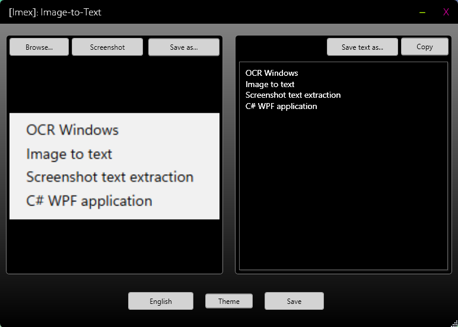

# [IMEX] : Image to Text

**Screenshot & Image → Text (OCR)**
Application portable Windows 11 développée en C#.

---

## 📥 Télécharger

👉 [Télécharger la dernière version](https://github.com/Liquid-F0rm/IMEX/releases/latest)

---

---

## 🖼️ Fonctionnalités

### 📸 Zone image (gauche)

* Capture d’écran (cliquer / glisser)
* Glisser-déposer (Drag & Drop)
* Import via explorateur de fichiers (formats : .jpg, .jpeg, .png, .ico, .bmp, .tiff)*
* Export de l’image en **.jpg** ou **.png**

### 📝 Zone texte (droite)

* Copier tout le texte
* Enregistrer en **.txt**
* Sélection partielle avec clic droit : Copier / Couper / Coller

### ⚙️ Paramètres

* 🌐 Langue : Français / Anglais
* 🎨 Thème : Clair / Sombre
* 💾 Sauvegarde de session
* Redimensionnement de la fenêtre

---

## 🖥️ Compatibilité

* Windows 11 (FR / EN)

---

## ℹ️ À propos

IMEX permet de capturer rapidement une image ou une zone d’écran
et d’en extraire le texte automatiquement (OCR).

---

## ⚠️ Sécurité

Lors du premier lancement, Windows peut afficher un avertissement
("éditeur inconnu"). C’est normal pour une application non signée.
Certaines conversions d'images en textes peuvent présenter des erreurs.

---

## 📌 Auteur

Projet développé par **Liquid-F0rm**
